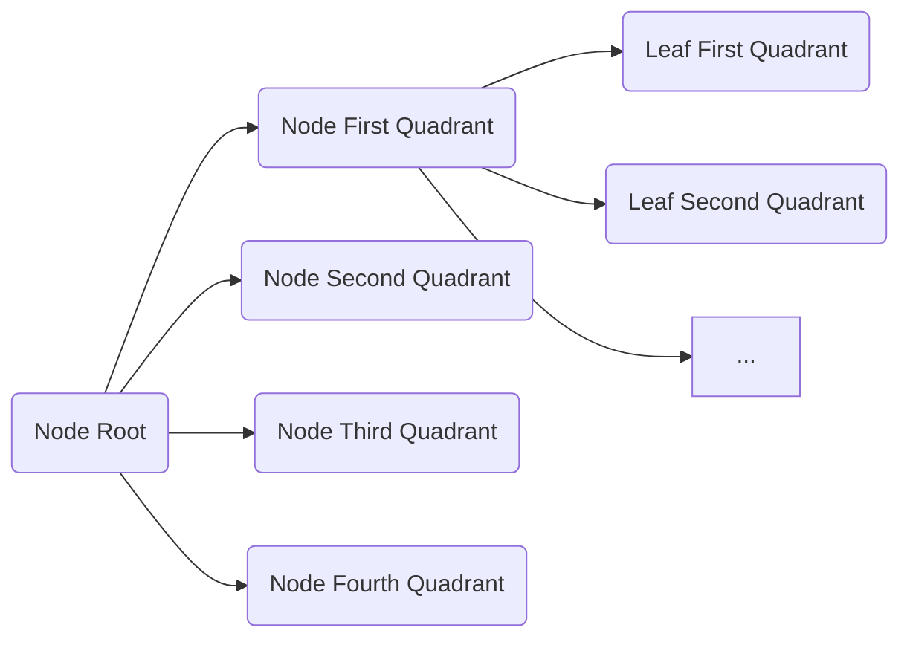

<h1><center>The Census Tract Lookup Algorithm</center></h1>
<center>Larry D. Lee jr. &lt;llee@asemio.com&gt;</center>
<center>March 24, 2023</center>

This technical note explains the algorithms and data structures used by the Census Tract Lookup Library. The library reads ArcGIS Shapefiles and DBF files from the TIGER/Line Shapefiles to determine the latitude and longitude of the points that outline census tracts and to determine information about them such as their name and internal designations.

The Shapefiles and DBF files are effectively lists of records. Each record represents a single census tract and the n-th record in a Shapefile corresponds to the same census tract as the n-th record in the corresponding DBF file. The Census Bureau creates and publishes these files, which can be downloaded from the Census Bureau's website[^1]. You can also find detailed information about these files on this site[^2].

The Census Tract Lookup Library allows users to determine the census tract that a given address lies within. To calculate this, the library has to read two different sets of files:

1. tl_2022_40_tract.shp - lists the latitude and longitude of the points that outline the census tracts in a given geographical area.
2. tl_2022_40_tract.dbf - lists information about the census tracts that lie in a given geographical area (for example, their name and governmental designations).
3. tl_2022_40143_addrfeat.shp - every linear feature (such as roads) are divided into segments whose endpoints lie on regional boundaries and intersections. The sides of these features may have a range of addresses, such as the addresses that lie between 100 and 150 E. Baker St. This file lists the latitude and longitude of the points that trace those linear features that have an address range in a geographical area.
4. tl_2022_40143_addrfeat.dbf - provides information about each address range listed in tl_2022_40143_addrfeat.shp. This includes the canonical name of the linear feature/road, the lower and upper bounds on the address range, and which side of the linear feature that range falls on.

The library was originally created to look up census tracts for addresses within Tulsa Oklahoma. Approximately 1,500 census tracts cover Tulsa and the Census Bureau defined approximately 45,000 road segments. While most of the census tracts within the city are rectilinear, many have complex non-convex shapes. Determining whether or not a given point lies within these shapes is computationally expensive, so it's critical that we minimize the number of operations.

To speed up lookups, the library indexes all of the census tracts into a tree structure and then indexes all of the street segments into a Hash table, which is indexed by canonical name. To canonicalize street names, the library uses the Libpostal[^3] machine learning model to parse and extract certain address components (house number and street name). These are concatenated into a string which is used as the lookup key for the hash table. When the library looks up the census tract that a given address lies within, it uses the Libpostal library to parse and canonicalize the address, finds the corresponding entry in the road segments hash table, and then iterates over the address ranges until it finds one that includes the given address's house number. 

The rest of this article explains the data structures and algorithms used to determine which census tract contains each road segment.

## The Census Tract Tree

The library creates a search tree and stores the census tracts within it. The tree has the following abstract data structure:

```ocaml
module Lookup = struct
  type 'a node = {
    bbox: Shape.BBox.t;
    children: 'a array;
  }

  type leaf = {
    bbox: Shape.BBox.t;
    children: tract Queue.t;
  }

  type t =
    | Node of t node
    | Leaf of leaf
  [@@deriving sexp]

...
end
```



Each node corresponds to a rectangular area and has four children corresponding to its four quadrants. The leaves in turn correspond to a rectangular area and list the census tracts that overlap with that area. In theory an arbitrary point within the region covered by a leaf could lie within any one of the associated census tracts. The tree, thus, partitions a region into a dense mesh of $4^n$ rectangular regions, where $n$ denotes the tree's depth.

Given the region covered by a node, we can efficiently calculate the bounding box covered by its children (this is done by the `Census_tract.get_quadrants` function). Furthermore, every census tract has an associated bounding box and we can easily determine when two bounding boxes overlap (this is done by the `Shape.BBox.overlaps` function). Accordingly, the library efficiently creates a tree to store the census tracts in `Census_tract.create_lookup_tree` and then adds the census tracts to the tree in `Census_tract.get_lookup_table`.

## Census Tract Lookup

Once the library creates the Census Tract Lookup Table, it begins locating the road segments. The `Address_features.get` function takes a road segment and searches the Census Tract Lookup Table to find those tracts that *might* include the segment. Specifically, the library identifies two points, one to the left, and the other to the right of the first linear segment along the road segment that are approximately 10 meters away. The function defines the `Census_tract.find_tract` function to determine which tract contains a given point. It recurses through the Census Tract Lookup Table for each of them and checks to see which leaf's bounding box contains the point. In general, each leaf is associated with a set of census tracts. The function then, iterates through this set checking to see which tract includes the point.

The library defines two methods to determine whether or not a census tract contains a given point. The first method is very fast but imprecise (it misclassifies some points near the boundary) and is based on approximating the census tract as a convex hull. The second method is precise, but slow. It uses the Jordan Curve theorem[^4] to determine whether or not the point is in the region.

Because the convex hull algorithm is so fast, the library first uses this algorithm to determine whether or not the point *might* be included in the census tract. Empirically, this rules out approximately 20% of candidates. Then it uses the more precise JCT algorithm to make the final determination.

## Point Inclusion: The Convex Hull Algorithm

The convex hull algorithm starts by identifying a central point $O$ located within the census tract. It then draws a line from that central point to each vertex on its boundary. The resulting fanout divides the shape into a set of overlapping triangles. It then iterates over these triangles checking to see if one of them contain the given point $p$.

### Triangle Inclusion

To do this efficiently, we define a transformation matrix for each triangle. The sides of the triangle that radiate from the center point $O$ act as basis vectors, $v_0$ and $v_1$, for a two dimensional space $S'$. Given $p$ in our initial space $S$, we can translate $p$ into a new point $p'$ in $S'$ by first translating the origin to $O$ using vector subtraction, and then by taking the dot product of $p$ and $v_0$ and $v_1$.

$$
\begin{align}
p' := \begin{bmatrix}
  v_0.x,\ v_1.x\\
  v_0.y,\ v_1.y
\end{bmatrix}\ (p - O)
\end{align}
$$

We then conclude that the triangle contained $p$ when: $0 < p'_x\ \wedge 0 < p'_y\ \wedge p'_x + p'_y \le 1$. Geometrically, this is equivalent to saying that $p'$ lies in the upper right quadrant of $S'$ within the region bounded by the line passing from $(0, 1)$ to $(1, 0)$.

Because the projection matrices in (1) do not depend on $p$, they can be computed ahead of time. The `Shape.Region.get_matrix` function computes these matrices and the `Shape.Region.matrix_contains` function uses these matrices to determine whether or note a point is included in their triangular regions. The `Shape.Region.contains` function takes the matrices that correspond to the triangles that comprise a region a checks whether or not one of them contains a given point.

Now, while this algorithm is very fast, it's imprecise. It's subject to "clipping," when the region is not convex. The following figure illustrates clipping. In general, clipping will only include additional points. As a result, in general, the set of points selected by this algorithm is a superset of the true set of points included in a given census tract.

## Point Inclusion: The Jordan Curve Algorithm

The Jordan Curve Algorithm is based on the Jordan Curve theorem[^4]. Given a census tract polygon, the algorithm identifies a point $O$ that lies outside the polygon's bounding region. It defines a line segment $s$ from that point to the given point $p$. It then counts the number of times $s$ crosses the polygon. $p$ lies within the polygon if $s$ crosses the boundary an odd number of times.To do this, it breaks the polygon into segments $\{ s_i \}$. It then iterates over these segments and counts the number of segments that $s$ intersects.

In general, two line segments $s_0$ and $s_1$ intersect iff:

$$
\begin{align}
intersect?\ (s_0, s_1) &:= \exists\ k_0\ k_1 \in \R, k_0\ \delta_0 + s_{0,0} = k_1\ \delta_1 + s_{1,0}\\
&\hspace{2em} \wedge 0 \le k_0 \le 1\\
&\hspace{2em} \wedge 0 \le k_1 \le 1
\end{align}
$$

where:

* $s_{i,0}$ denotes the line segment $s_i$'s starting point (and $s_{i,1}$ denotes its endpoint)

* and $\delta_i := s_{i,1} - s_{i,0}$.

We can combine (2) into a matrix expression, solve for $k_0$ and $k_1$, and check that they fall within the prescribed bounds. Doing so gives the following expression:

$$
\begin{align}
\begin{bmatrix}
  k_0\\
  k_1
\end{bmatrix} =
\begin{bmatrix}
  \delta_0.x,\ -\delta_1.x\\
  \delta_0.y,\ -\delta_1.y\\  
\end{bmatrix}^{-1} (s_{1,0} - s_{0,0}).
\end{align}
$$

The `Geometry.intersect` function performs this operation. It computes the values for $k_0$ and $k_1$ using these operations and then checks that they fall within the necessary bounds.

The discussion up until now has glossed over several important edge cases that must be handled when using this method. First, $s$ can intersect two segments $s_{i}$ and $s_{i + 1}$ through a shared endpoint. When this occurs we should not count each intersection twice. We can handle this case effectively by counting each endpoint intersection as $\frac{1}{2}$. This way, two endpoint intersections, will be counted correctly as a single boundary crossing.

The second edge case is that $s$ may run along one of the polygon edges. In this case, the matrix in (5) does not have an inverse because the column vectors are linearly dependent. In general, two line segments $s_0$ and $s_1$ are collinear and "overlap" (see below) iff:

$$
\begin{align}
collinearOverlap? (s_0, s_1) &:= \exists\ k_0\ k_1 \in \R, k_0\ \delta_0 + s_{0,0} = s_{1,0} \wedge\ k_1\ \delta_0 + s_{0, 0} = s_{1, 1}\\
&\hspace{2em}\wedge 0 \le k_1 \le 1.
\end{align}
$$

Where we say that the two segments "overlap" iff $s_1$'s endpoint lies on $s_0$. The `Geometry.collinear_point` function is responsible for detecting when a point lies on a polygon edge, and it is called by `Geometry.intersect`. One last note, to maximize performance, `Geometry.intersect` does not explicitly create and invert the matrix in (5). Instead, it "unfolds" the arithmetic operations.

## References

[^1]: 2022 TIGER/Line® Shapefiles: Census Tracts. (n.d.). Retrieved March 24, 2023, from https://www.census.gov/cgi-bin/geo/shapefiles/index.php?year=2022&layergroup=Census+Tracts
[^2]: United States Census Bureau. (n.d.). TIGER/Line Shapefiles and TIGER/Line Files Technical Documentation. Retrieved March 24, 2023, from https://www.census.gov/programs-surveys/geography/technical-documentation/complete-technical-documentation/tiger-geo-line.html 
[^3]: Libpostal: international street address NLP. (n.d.). Retrieved March 24, 2023, from https://github.com/openvenues/libpostal 
[^4]: Wikipedia: Jordan curve theorem. (n.d.). Retrieved March 24, 2023, from https://en.wikipedia.org/wiki/Jordan_curve_theorem 
